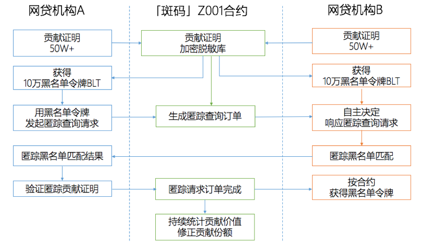

# 「斑码」Z001号合约

## 1.	概述
>「斑码」Z001号合约，目标是实现小额短期贷款M3+坏账用户的联防联控，降低合约参与方的坏账风险。

>「斑码」Z001号合约早期阶段坏账信息200～500万条，最终覆盖小额短期贷款95%以上坏账信息。

>「斑码」合约是一种匿踪的数据共享和查询协议，在数链对等网络上运行，由多家机构共同参与，数链团队进行编制和实现。该协议包含了数据指纹验证、贡献证明上链、匿踪查询匹配、通证激励分配等机制，让机构可以联合建立真实优质的黑名单加密脱敏共享库，在合规的数据使用条件下，匿踪查询和识别有过确切坏账记录的高风险贷款申请者，提高群体风控能力，直接降低坏账率，并且利益公平、权利对等、真实可验、流程合规。


## 2.	定义、关键指标与参数
### 2.1.	术语定义
| 术语名称 | 定义 |
| -------- | -------- |
| 【黑名单】 |  本合约特指小额（贷款额低于3000元）、短期（借贷周期低于3个月）、M3+（逾期超过90天）的坏账信息。 |
| 【贡献证明】 | 由合约参与方基于自身真实的坏账信息，生成加密脱敏后的摘要及数字签名，作为确权数据，就是贡献证明。每一条坏账信息产生一条贡献证明。 |
| 【贡献证明 命中摘要】 | 贡献证明中命中信息和随机码的MD5摘要数据。 |
| 【贡献证明 详情摘要】 | 贡献证明中逾期金额、逾期期数、时间戳和随机码的MD5摘要数据。 |
| 【匿踪查询】 | 在隐藏查询目标的情况下进行查询和匹配，保护查询方的信息不外泄。 |
| 【有效命中】 | 匿踪查询中，查询方和被查询方的信息匹配成功，且对应的贡献证明命中摘要得到验证，称为有效命中。 |
| 【黑名单令牌】 | 「斑码」Z001合约内定义的Token，是该合约内向其他参与方发起匿踪查询时唯一的记账单位。符号：BLT。 |
| 【合约创始方】 | 「斑码」Z001合约的初始创建方由几家头部互金公司发起。 |
| 【合约参与方】 | 「斑码」Z001合约的参与方，需至少两家合约创始建设方的投票审核通过或5家合约参与方的投票审核通过才能加入。 |
| 【贡献份额】 | 合约参与方得到验证（有效命中）的贡献证明量占全部得到验证的贡献证明量比例。  当合约内黑名单令牌流通量不够需要增发时，按照贡献份额进行增发。 |

### 2.2.	关键指标
| 指标名称 | 定义 |
| -------- | -------- |
| 【贡献证明量】 | 整个合约的贡献证明量。 |
| 【有效命中率】 | 有效命中次数占查询次数的比例。 |
| 【有效贡献比例】 | 贡献证明中被有效命中的比例。 |
| 【共识率】 | 对于命中结果无争议的次数占有效命中次数的比例。 |

### 2.3.	主要参数
| 名称 | 定义 |
| -------- | -------- |
| 【查询奖励】 | 每次查询所需的黑名单令牌，为【0.01】BLT，有响应的参与方平分。 |
| 【查得奖励】 | 每次查询命中所需的黑名单令牌，为【0.5】BLT，有效命中的参与方按贡献证明时间系数分配。 |
| 【详情奖励】 | 进行详细核验所需的黑名单令牌，为【0.4】BLT，响应详情的参与方平分。查询详情是可选项。 |
| 【时间奖励系数】 | 当一次查询超过1个贡献证明被有效命中时，最早登记的贡献证明获得最多的黑名单令牌奖励。奖励系数取值【0.8】。 |
|  | 第一位：奖励额 * 奖励系数 |
|  | 第二位及之后：奖励额 * （1 - 奖励系数） |
|  |  |
| 【合约抵押】 | 参加合约必须抵押【5万】链积分。 |
| 【最低贡献证明】 | 参与合约最低贡献证明量，【5万】条。 |

## 3.	主要流程


## 4.	参与规则
### 4.1.	合约创始成员
「斑码」Z001合约由三个合约创始成员达成共识发起并创建。
### 4.2.	合约参与成员
除了合约创始成员，其他合约参与成员加入合约，必须得到至少【2】个合约创始成员的同意或【5】个合约参与成员的同意。以合约内投票为准。
### 4.3.	合约参与和使用条件
（1）	每个合约参与成员，需向合约抵押【5万】相应链积分；
（2）	每个合约参与成员，需达到最低【5万】条贡献证明，才能获得【5万】黑名单令牌，并开始使用。
### 4.4.	合约退出条件
合约参与成员的黑名单令牌余额必须超过【5万】，才能退出合约并退回5万链积分的抵押。

## 5.	数据规格
### 5.1.	贡献证明数据规格
| 序号 | 字段名称 |说明 |
| -------- | -------- | -------- | 
| 1.         | 命中摘要 |MD5（二要素MD5+随机因子） |
| 2.         | 详情摘要 |MD5（二要素MD5+逾期金额范围+逾期期数+逾期发生时间+随机因子） |
| 3.         | 命中摘要 数字签名 |命中摘要数字签名 |
| 4.         | 详情摘要 数字签名 |详情摘要数字签名 |
| 5.         | 贡献证明者ID |贡献证明者的数链账号名 |
| 6.         | 贡献证明所在区块高度 |贡献证明登记区块的高度 |
| 7.         | 贡献证明登记ID |贡献证明登记交易的ID |
| 8.         | 贡献证明登记时间 |贡献证明登记交易的时间 |
| 9.         | 贡献证明有效命中次数 |贡献证明有效命中次数 |


### 5.2.	匿踪查询入参
| 序号 | 字段 |字段名称 | 说明 |
| -------- | -------- | -------- |  -------- | 
| 1.         | md5Code |模糊查询MD5前7位 | 二要素MD5编码前7位字符（16字节，32字符） |
| 2.         | verifyMd5Code |二次验证哈希编码 | MD5（二要素MD5 字符串+ 临时随机因子） |
| 3.         | requestedFactor |临时随机因子 | 64位（8字节） |
| 4.         | continuePreciseQuery |是否进行详细查询 |  |

### 5.3.	匿踪查询返回数据
| 序号 | 字段 |字段名称 | 说明 |
| -------- | -------- | -------- |  -------- | 
| 1.         | token |精确查询token | （有精确查询token即表示：命中，为空则：不命中） |
| 2.         | staticProof |贡献证明凭证 |  |
| 3.         | reportSummary |贡献证明命中摘要 |  |
| 4.         | staticFactor |贡献证明随机因子 |  |

### 5.4.	详情查询返回数据
| 序号 | 字段 |字段名称 | 说明 |
| -------- | -------- | -------- |  -------- | 
| 1.         | hitTwoRandomHash |贡献证明凭证 |  |
| 2.         | overdueData |逾期信息 | 请查看下文注释1 |
| 3.         | timeStamp |贡献证明时间戳 | （4）     贡献证明上链时间，对于数据回溯有用 |
| 4.         | privacyHash |贡献证明详情摘要 |  |
| 5.         | randomCode |贡献证明详情随机因子 |  |

## 系统部署
[点击跳转到部署说明页](https://github.com/unitedata-org-public/Documentation/blob/master/banma_quick_start.md)


##### 注释1:
逾期信息格式如下：

````
{
	// 逾期金额枚举：small（小 <2k）、middle（中 2k-3k）、big（大 >3k）
	"amount": "big",
	//逾期类型：M1,M2,M3
	"type": "M3",
	//入黑时间戳（毫秒）
	"into_time": 1547021423000
}
````
