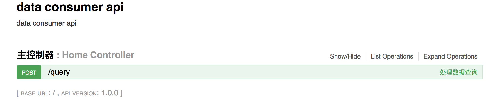

# 数据使用方-数据服务 API 部署文档

## 引言

数据服务 api 是基于 http[s] 协议的一个数据客户端服务。它进一步封装了数据服务 SDK，并且提供了一组 restful API 风格的简单接口

## 如何部署

* 自行搭建 tomcat 服务器
* [下载数据服务war包](https://github.com/unitedata-org/UniteData/tree/master/ud-data-consumer-server)
* 将下载的 war 包部署到 tomcat 服务器中
* 启动 tomcat 服务器
* 打开浏览器，输入地址 http://{域名}/swagger-ui.html，看到下图

## 数据服务配置

数据服务可配置内容：

* account=合约访问账户
* password=合约访问账户密码
* privateKey=合约访问账户私钥
* contractApi=合约 API 地址
* contractResolver=合约处理器类型，默认使用 eos 合约处理器

数据服务的配置信息通过三种方式获取，优先级依次提高，操作系统环境变量的优先级最高：

* 应用配置文件 application.properties
* 外部应用文件 /{path}/application.properties
* 操作系统环境变量

## 自定义外部配置

外部配置文件使用 peoperties 文件

默认的外部配置文件路径为：/usr/local/config/application.properties

可以通过设置操作系统环境变量propertiesFileName来改变外部配置文件的路径
