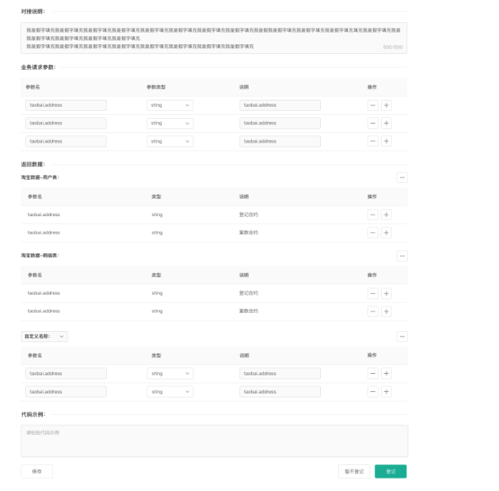
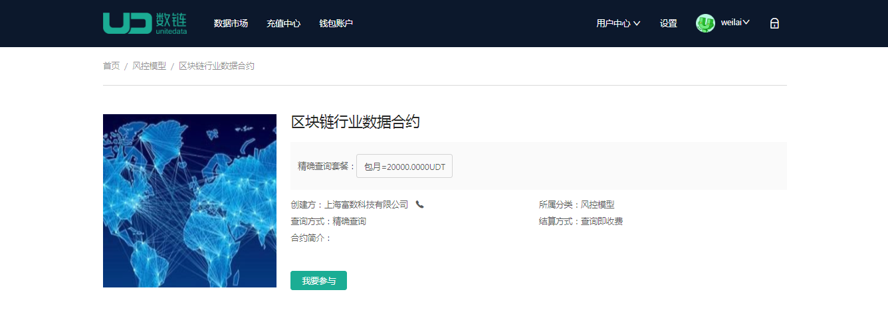
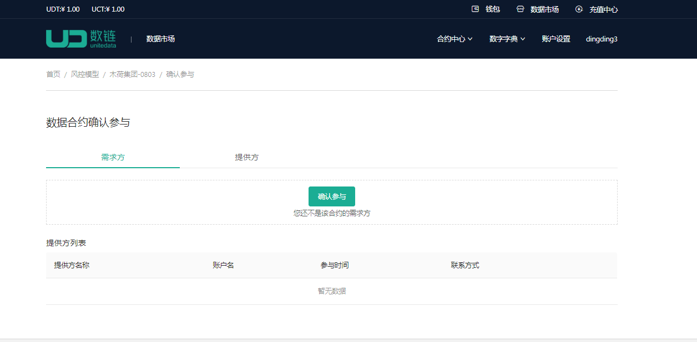
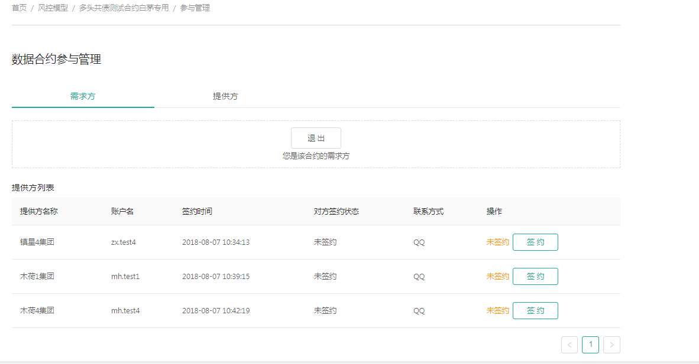
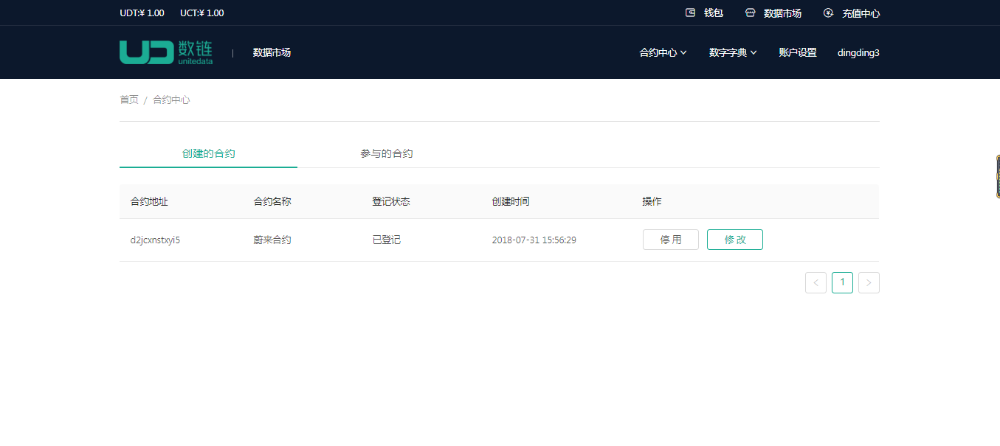

### 创建合约说明
##### 当你有数据需求/提供时，但没有合约满足你的需求时，你可以选择创建合约
##### 基本流程：创建合约->登记合约->创建完成

1. 选择合约中心下的【创建合约】菜单，进入创建合约页面，如图
	
2. 上传合约程序文件，接口描述文件，以及合约命名，点击【下一步】进入登记合约页面，如图。
3. 补充合约信息，设置API详情，模型相关信息，合约属性，联系方式等
	* API设置
		* 

	* 业务请求参数 
		* 返回参数：根据合约配置的数据字典生成所需的请求参数，若还需额外的参数可进行自定义配置

	* 模型相关:包含了模型设置和多方计算配置。

	* 模型设置
		* 上传模型文件，设置模型所需的数据字典。
	* 多方计算设置
		* 若合约中设置了多方计算，则需要设置多方计算所需的输入参数和多方计算的输出表达式
	* 联系方式
		* 配置该合约对应的联系方式，包含手机号码，聊天软件，邮箱等信息

### 参与合约
##### 基本流程：选择参与的合约à点击【我要参与】à商户签约à参与成功
1. 选择参与的合约。点击后进入合约详情
	* 
2. 点击【我要参与合约】进入确认参与页面，选择参与角色，输入钱包密码，参与成功。
	* 
3. 提供方/需求方点击【签约】按钮，进行签约。另外一方进行确认后即达成合作
	* 
4. 参与成功
5. 查看参与的合约
	* 可以查看【创建的合约】和【参与的合约】，如图
		* 

