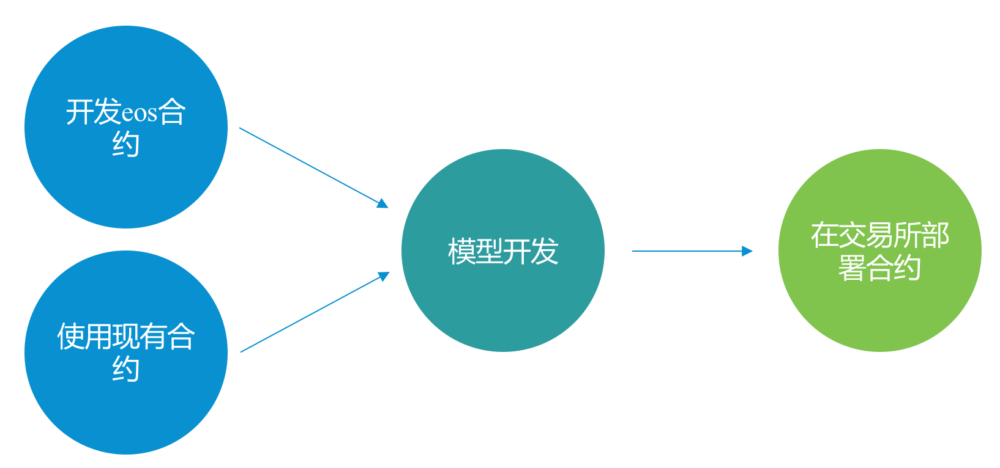
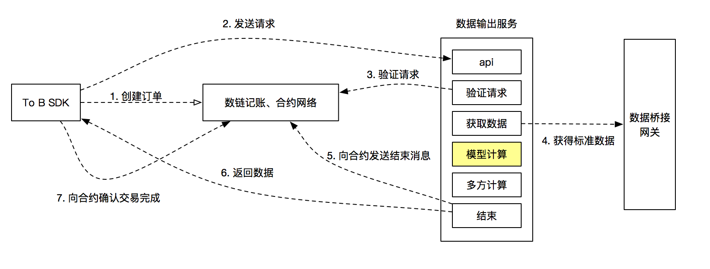

# 合约开发流程
1. 流程图
	* 
3. 合约模型开发
	* 模型在整个流程中的位置：
	* 
	* 模型要作的事情
		* 系统执行框架会将数据桥接网关获取的数据输入到模型
		* 模型可以对数据作任意形式的计算，模型计算的结果可以直接输出到sdk端也可以作为多方计算的输入
		* 可能的模型计算示例：计算用户每月淘宝消费总金额与总笔数
			* 从数据网关获得淘宝订单数据作为模型的输入
			* 模型按月对数据进行聚合，统计每月的消费金额和笔数
			* 将统计值作为输出，返回到sdk端或作为多方计算的输入
	* [合约模型开发说明](model-calc-sdk-doc.md)
4. [单次查询数据合约](signing_query_contract.md)
5. [批量合约](batch_data_contract.md)