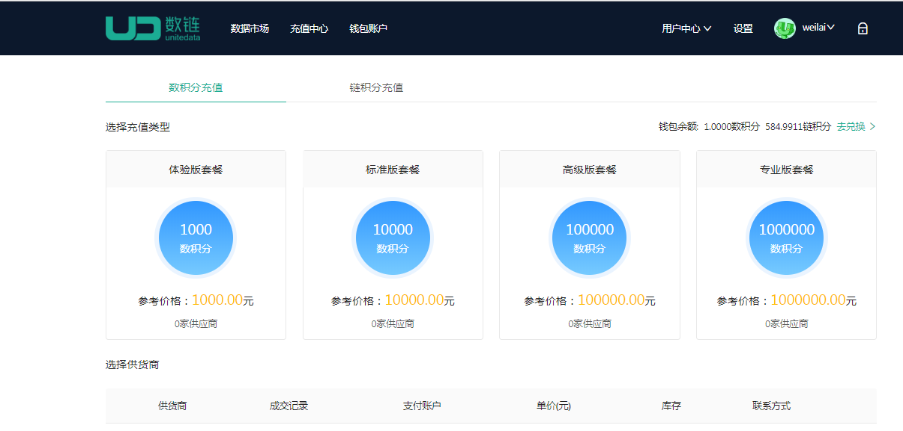
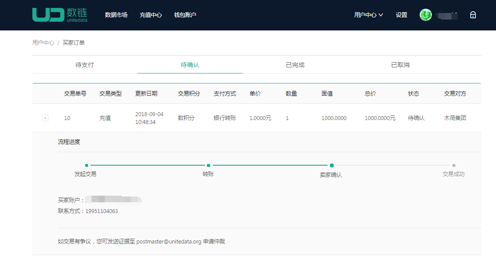
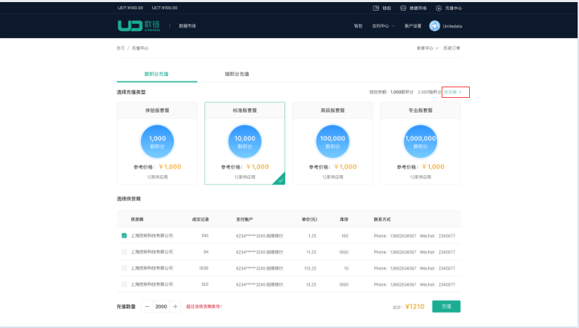
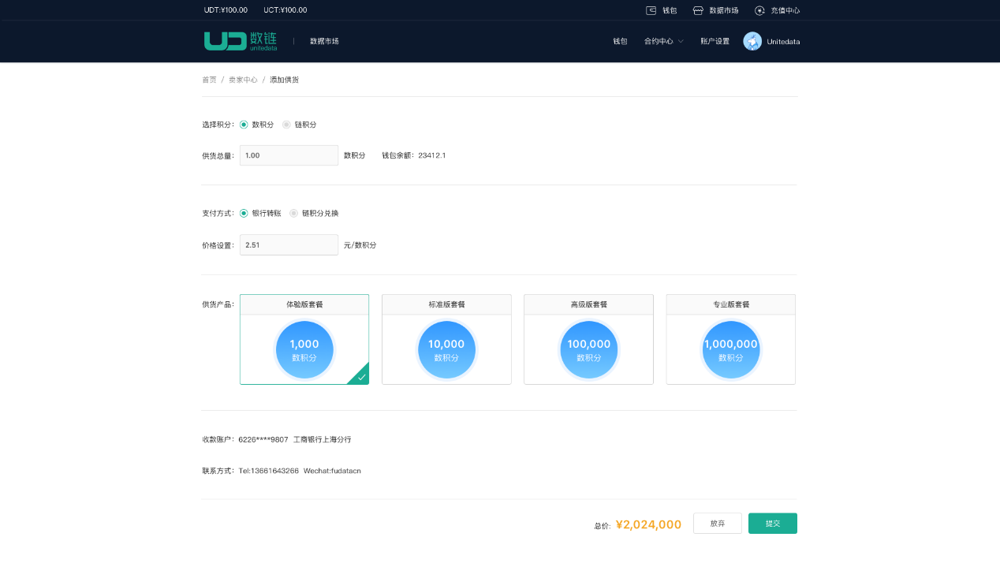
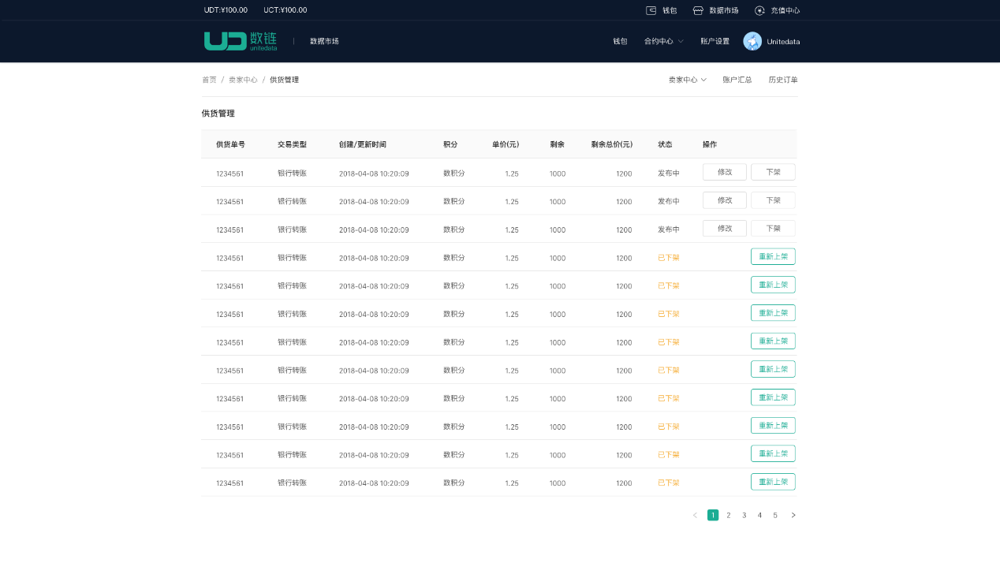

# 充值中心
##### 充值中心：用于充值或者出售链积分和数积分

1. 充值积分
    * 基本流程：选择套餐和供货商->确认充值->线下打款->确认收款
   
    * 点击【充值中心】，进入充值中心页面，选择充值套餐和供应商，点击【充值】。如图
    * 用户线下转账到卖家银行卡，然后点击【已转账】，如图
    * 
    * 卖家确认收款后，点击【已收款】
    * 交易成功
2. 兑换积分
    * 基本流程：选择套餐和供货商->确认兑换->输入钱包密码
    * 点击【充值中心】，进入充值中心页面，点击【兑换】，如图
    * 
    * 选择充值套餐和供应商，点击【充值】.
    * 输入钱包密码，兑换成功
3. 添加供货
    * 基本流程：选择供货中心下的添加供货->填写供货信息->输入钱包密码à供货成功
    * 点击供货中心下的【添加供货】菜单，进入添加供货页面
    * 填写供货信息，点击【提交】按钮，如图
    * 
    * 输入钱包密码，点击【确认】，供货成功
4. 供货管理
    * 点击供货中心下的供货管理菜单，进入供货管理页面。可查看所有供货账单，如图
    * 
5. 订单中心
    * 卖家订单
        * 点击订单中心下的【卖家订单】菜单，进入卖家订单页面。可查看所有的卖家订单，如图：
        * 
    * 买家订单
        * 点击订单中心下的【买家订单】菜单，进入买家订单页面。可查看所有的买家订单，如图：
        * 
