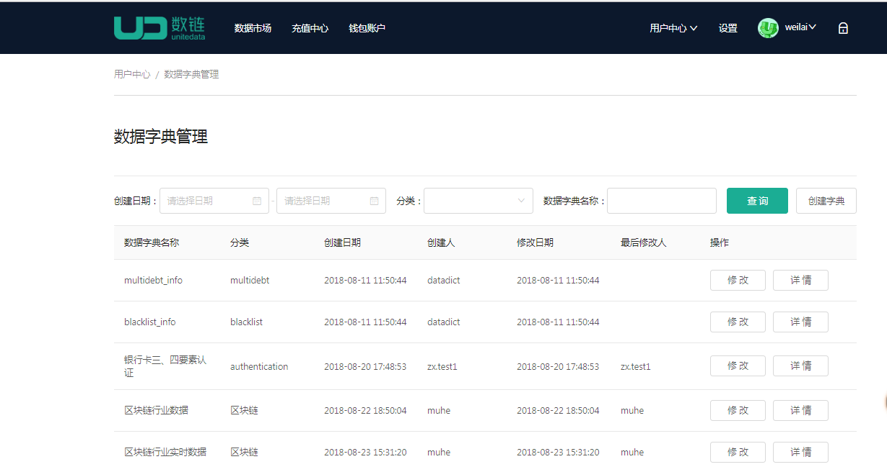
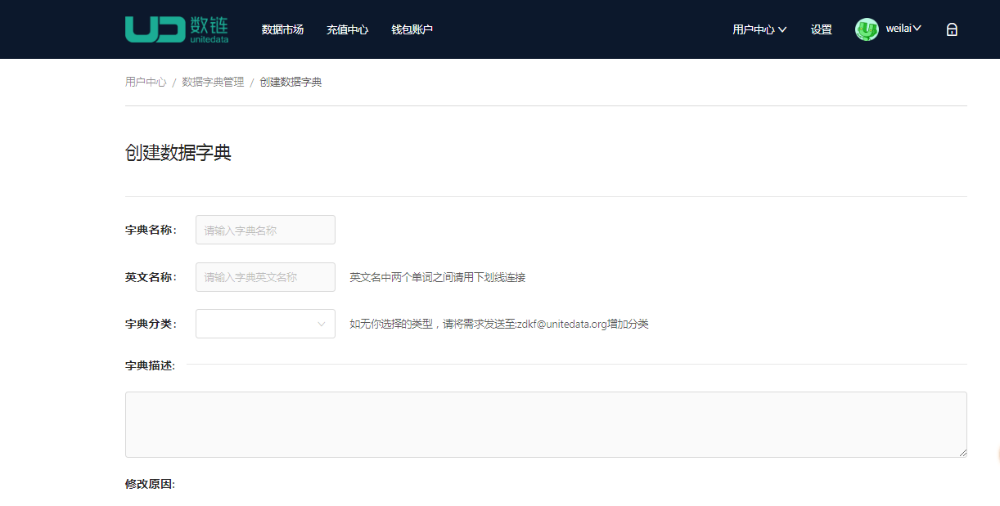
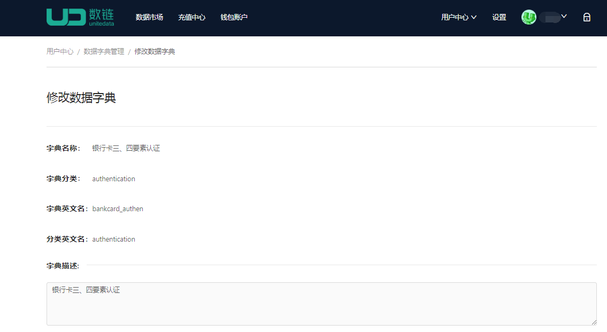

# 数据字典
##### 此处管理的为标准的数据字典。可在创建合约的时候直接使用。

1. 【创建数据字典】
    * 基本流程：点击创建数据字典->输入数据字典信息->钱包密码确认->联盟投票->创建成功
    * 点击【创建字典】，进入数据字典页面
    
    * 
    * 输入或者上传字典信息，点击【提交】
    
    * 
    * 支付所需的UCT并输入钱包密码，点击【确定】
    * 联盟成员投票，达到半数以上投票通过，创建数据字典完成
2. 【修改数据字典】
    * 基本流程：点击创建数据字典->输入数据字典信息->钱包密码确认->联盟投票->创建成功
    * 选择需要修改的数据字典，点击【修改】，进入数据字典页面
    
    * 
    * 输入字典信息，点击【提交】
     
    * 
    * 支付所需的UCT并输入钱包密码，点击【确定】
    * 联盟成员投票，达到半数以上投票通过，创建数据字典完成
3.  我的数据字典
    * 点击【我的数据字典】，可查看我修改或者创建的数据字典
    
    * 