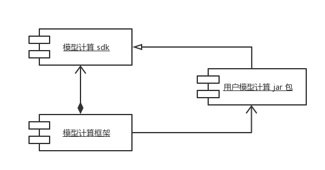
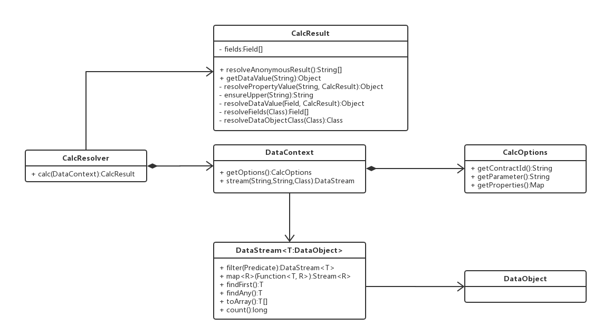

# 模型计算 sdk 接入文档

## 引言

模型计算是 B 端业务功能支撑体系中的核心部分。居中协调其它业务功能，并主导完成整个业务线。

## 模型计算

如下图所示，模型计算框架分为两个部分：模型计算框架；模型计算 sdk 包。其中模型计算框架是多方计算的核心部分，它将完成整个模型计算的大部分业务功能。模型计算 sdk 包是提供给用户的一个自定接入模型计算的入口模块，声明了接入模型计算的一些描述性接口。


## 如何接入模型计算 ？

用户接入模型计算是通过实现模型计算 sdk 包中声明的接口描述达到目的的。下图为模型计算 sdk  的类结构图：



接口 CalcResolver 为核心接口，用户通过实现这个接口来达到接入多方计算的目的。该接口声明了唯一的函数 calc ，这个函数也是帮助用户接入模型计算的唯一入口。它接收一个 DataContext 类型的参数，并返回一个 CalcResult 类型的结果。

接口 DataContext 声明了数据上下文的基本结构。在接入模型计算时，用户可以通过这个类型的实例来获取上下文中的实际数据。

抽象类 CalcResult 定义了一个基本的模型计算结果。在接入模型计算时，用户需要返回这个类型或者派生类型的一个实例对象。

接口 CalcOptions 声明了模型计算的参数上下文。在接入模型计算时，用户可以通过 DataContext 类型的实例上下文得到该类型的对象。

接口 DataStream 是一个泛型接口，定义了数据上下文的数据接口，及其查询方式。在接入模型计算时，用户使用这个类型的实例来实现从数据上下文中获取具体数据的目的。

接口 DataObject 用来声明模型计算中的数据对象类型

## 模型计算接入示例

``` java
/**
 * 主要服务
 * @author baimao
 *
 * 一个查询指定类型的人员信息统计查询。统计信息包含人员总数量，平均年龄，最大和最小年龄
 */
public final class MainService implements CalcResolver {

    private static final String defaultSchemaName = "taobao";
    private static final String defaultTableName = "tbdata_info";

    @Override
    public CalcResult calc(DataContext context) {
        Integer[] arr
                = context.stream(defaultSchemaName, defaultTableName, Data.class)
                .map(d -> ((Data)d).age)
                .toArray(Integer[]::new);

        int min, max, sum = 0;
        max = min = arr[0];
        for(int v : arr){
            if(min > v){
                min = v;
            }

            if(v > max){
                max = v;
            }

            sum += v;
        }
        return new Result(arr.length, (double)sum/arr.length, max, min);
    }

    private final class Result extends CalcResult {

        // 数量
        private long count;
        // 平均年龄
        private double avgAge;
        // 最大年龄
        private int maxAge;
        // 最小年龄
        private int minAge;

        Result(long count, double avgAge, int maxAge, int minAge) {
            this.count = count;
            this.avgAge = avgAge;
            this.maxAge = maxAge;
            this.minAge = minAge;
        }

        public long getCount() {
            return count;
        }

        public double getAvgAge() {
            return avgAge;
        }

        public int getMaxAge() {
            return maxAge;
        }

        public int getMinAge() {
            return minAge;
        }

        /**
         * 获取匿踪查询结果
         * @return
         */
        @Override
        public String[] resolveAnonymousResult() {
            return super.resolveAnonymousResult();
        }
    }

    /**
     * 数据类型
     * {\"id\":1,\"name\":\"zhangsan\",\"age\":20}
     */
    private static final class Data implements DataObject {

        public long id;
        public String name;
        public int age;
    }
}
```

## 部署计算模型

在开发完成计算模型之后，将计算模型打包，并上传到您创建的数据合约中。
详细流程请查看：[数据交易所操作说明](files/数链产品使用说明书.pdf)

## 模型计算开发语言支持列表

* java
