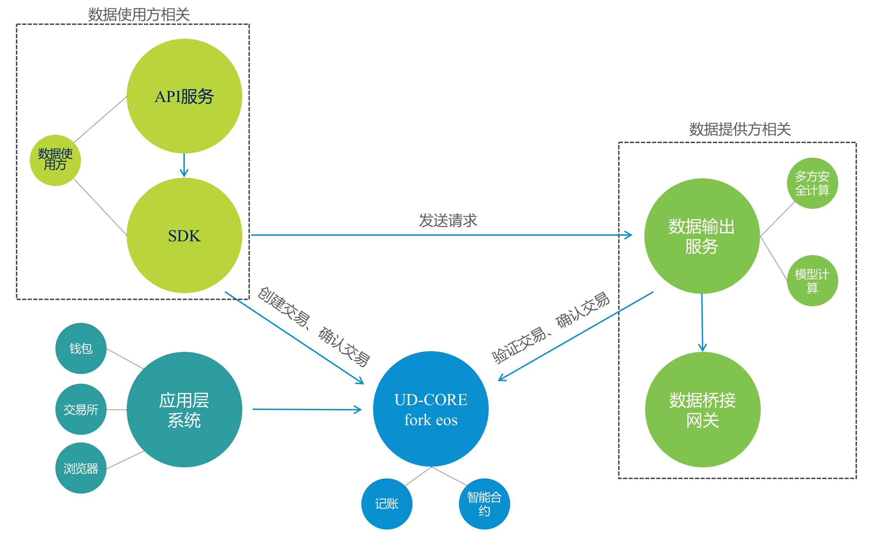

# 系统组成
 
 
* 数据提供方相关
	* 数据桥接网关
		* 作用：从提供方内部获得数据，将数据转换成数链标准格式输出
		* 转换方式包括：
			* sql方式转换
			* 自定义转换：实现指定接口
	* 数据输出服务：
		* 作用：用来向使用方提供数据的接口，使用方sdk通过访问此服务来获取数据
		* 包含功能：
			* 模型计算模块：对从数据桥接网关获得的数据进行需要的计算
			* 安全多方计算模块：对多方数据进行整合计算，可以达到参与各方数据不泄漏
* 数据使用方相关
	* sdk：通过sdk获取数据
	* api服务：将sdk进行包装，以服务形式向业务系统提供服务
	* 以上两种方案均可选择，看业务方自己需要