# 钱包使用
## 创建账号
##### 基本流程：1.创建一个钱包和账号 -> 2.备份钱包 -> 3.创建成功
1. 创建一个钱包和账号
	* 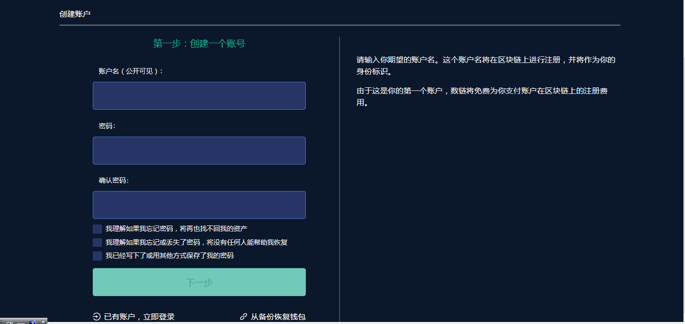
	* 输入账号，密码，确认密码，勾选协议。点击【下一步】
	* 注意点：账户名规则为5-12位，以小写字母+数字+点号组成，最后一位不能为点号。
2.备份钱包
	* 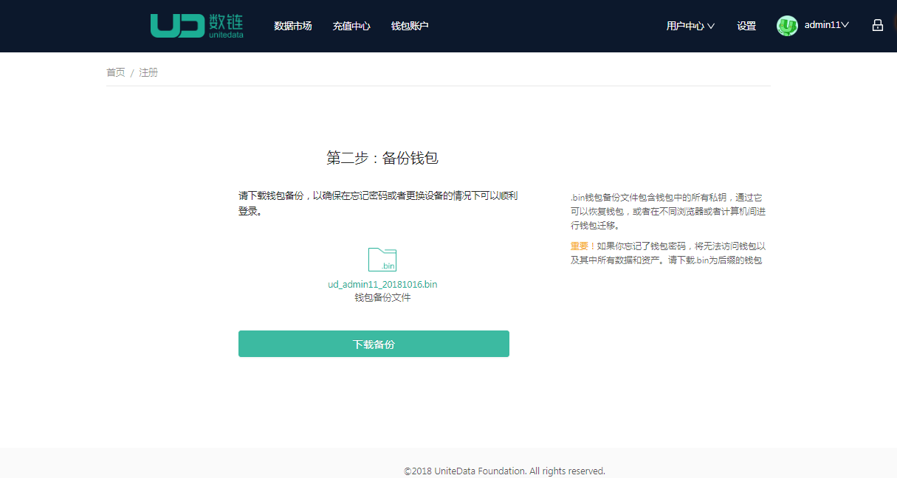
	* 点击【下载备份】按钮，将钱包备份文件保存到本地。
3. 创建成功
	* 提示账号创建成功，用户可选择进入首页。

## 账户

##### 账户分为链积分账户和数积分账户
      
   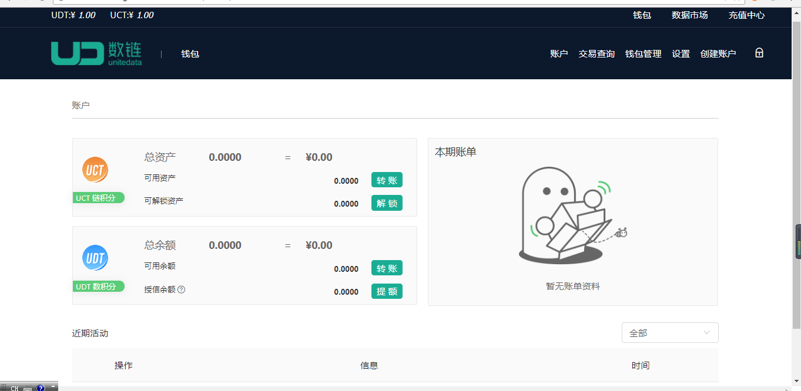 

    

1. 【链积分账户】
	* 可用资产：可用于转账给其他账户，可通过奖励，充值获得。
    * 可解锁资产：用链积分授信产生数积分授信额度后，未使用的部分可进行解锁为链积分
    * 赎回中资产： CPU和NET资源赎回后的金额需要3天后才能到账，在这3天时间内，该金额会显示 在赎回资产中。

2. 【数积分账户】
	* 可用余额：即可用的数积分余额，非授信产生。从充值，买数据获得，可用于还款账单。
    * 授信余额：用链积分根据一定比例锁定产生数积分额度，可用于购买数据。

3. 【转账】
	* 基本流程：输入转账信息 -> 转账成功
		* 输入发往账户，转账金额，备注信息（备注信息为选填）点击【立即转账】
		* 输入钱包密码，确认转账。
		* 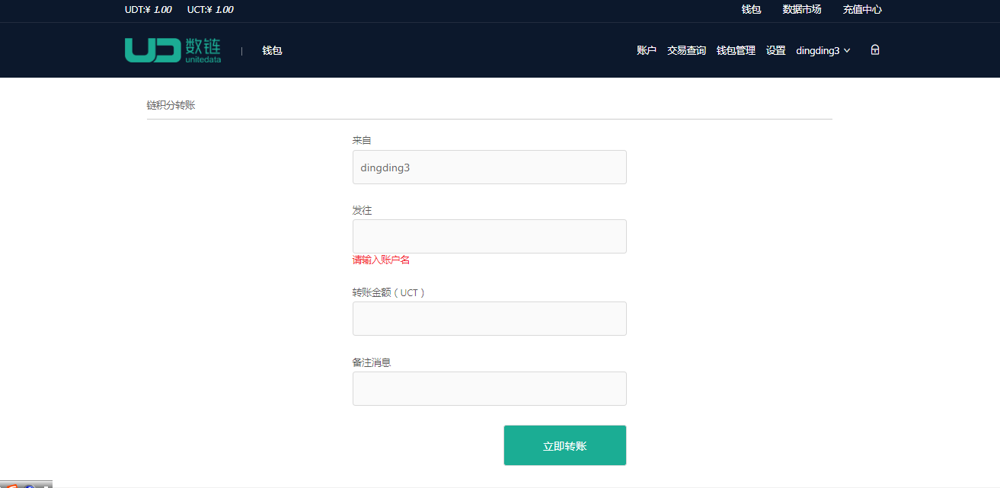
4. 【解锁】
	* 解锁：未使用的授信额度可通过解锁操作变成可用的链积分余额，同时授信余额也减少
	* 输入解锁金额，点击【解锁】
	* 输入钱包密码，点击【确定】
	* 

5. 【提额】
	* 提额：提高授信余额，同时会按照一定比例锁定链积分资产到锁定余额中。
	* 输入提升额度，预计锁定资产自动计算。点击【提升额度】
	* 输入钱包密码，点击【确定】
	* 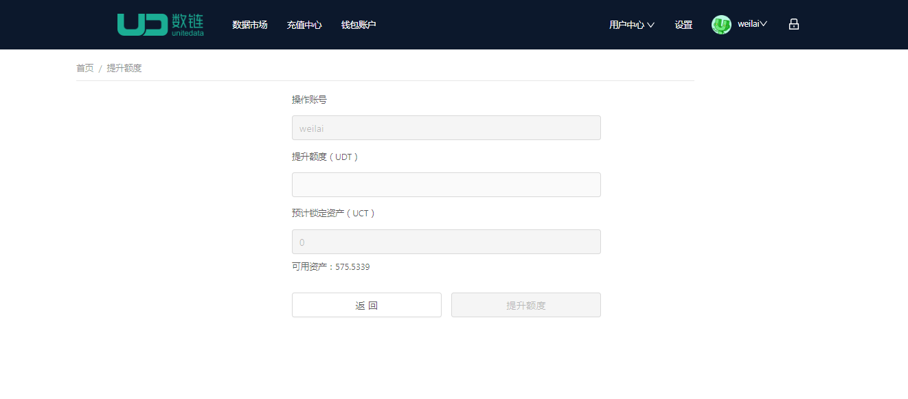

6. 【还款】
 	* 还款：每月用授信额度消费，会在账单日产生账单。按期还款。可获得数积分额度。
	* 基本流程：点击【立即还款】-> 输入钱包密码 -> 成功
	* 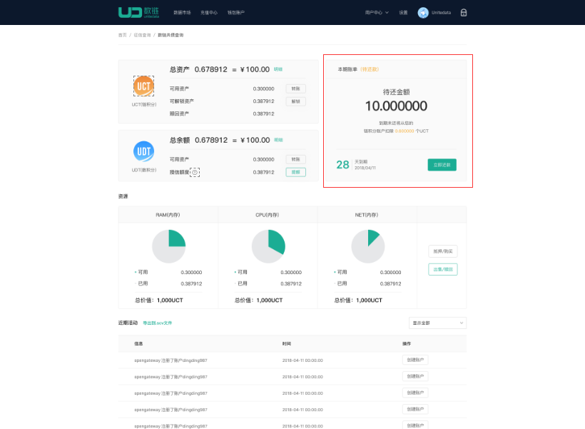
7. 【购买/抵押资源】
    
    购买资源：账户页面-> 点击【购买/抵押】-> 输入购买资源数链-> 钱包密码-> 购买成功
    * 账户页面，点击【购买/抵押】 ，如图：
    * 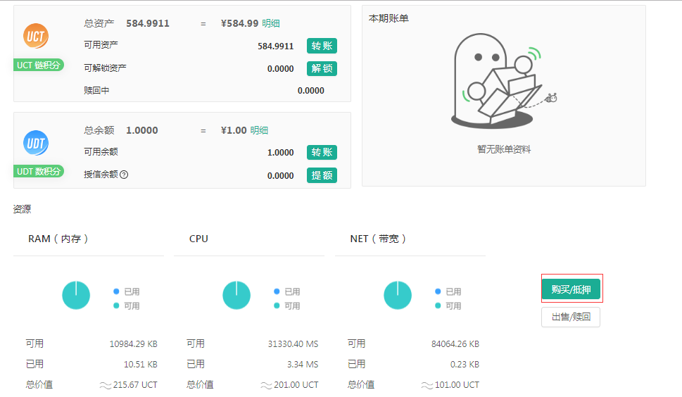
    * 进入购买资源页面，输入购买信息。如图：
    * 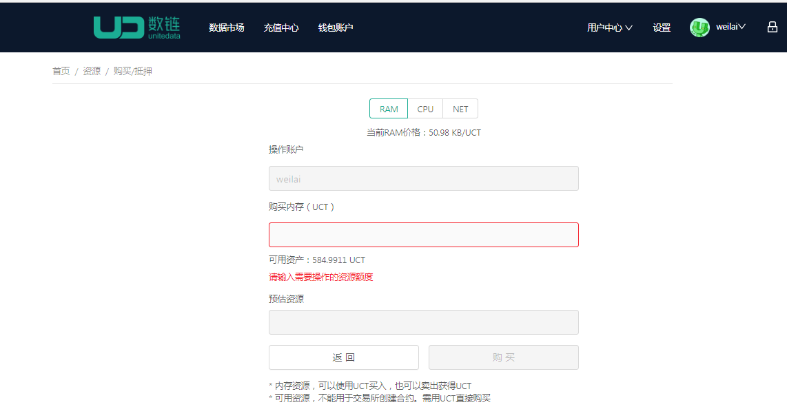
    * 点击【购买】，输入钱包密码，购买成功。
8. 【出售/赎回资源】

    出售/赎回资源：账户页面->点击【出售/赎回】->输入出售资源数量->钱包密码->出售成功
    * 账户页面，点击【出售/赎回】 ，如图
    * 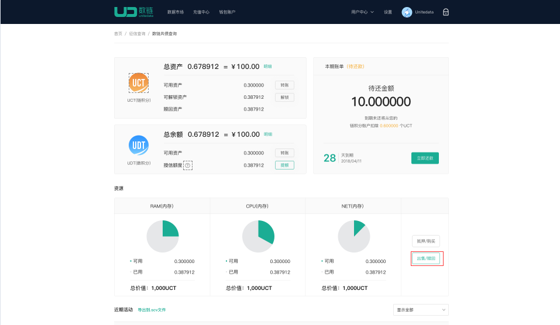
    * 进入出售资源页面，输入出售信息。如图：
    * 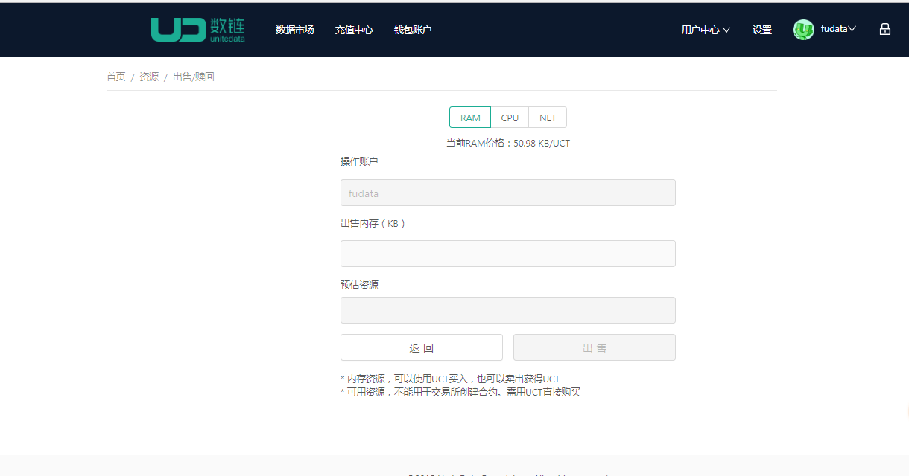
    * 点击【出售】，输入钱包密码，出售成功
9. 交易查询
	* 进入交易查询页面，可查看各个操作产生的链积分和数积分交易。
	* 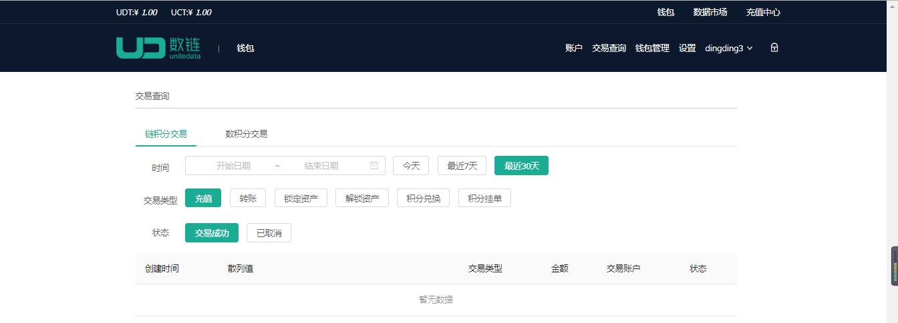

## 钱包管理
1. 【创建钱包】
基本流程：设置-> 钱包管理-> 创建钱包-> 创建钱包成功，返回钱包管理页
	* 输入钱包名字，密码，确认密码，点击【创建钱包】
	* 返回钱包管理页面，显示新创建的钱包
	* 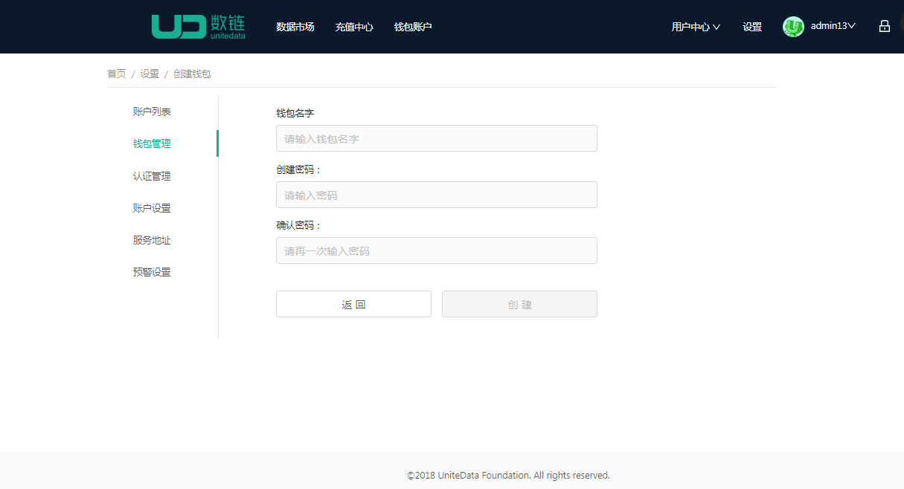
2. 【导入私钥】

	基本流程：点击【导入私钥】->导入私钥->返回钱包管理

	* 钱包管理页面，选择需要导入私钥的钱包，点击【导入私钥】
	* 输入私钥，钱包密码，点击【提交】
	* 导入成功返回钱包页面
	* 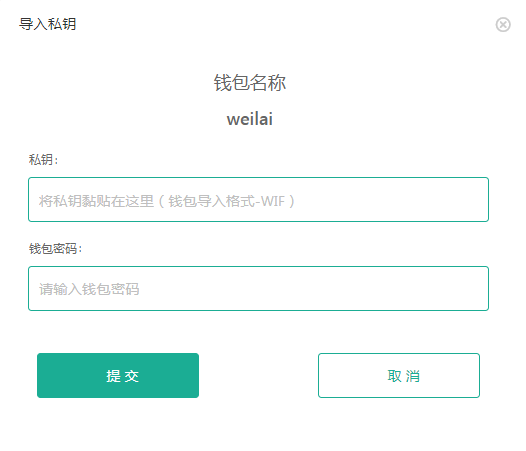
3. 【备份钱包】

	基本流程：点击【备份钱包】->下载备份文件

	* 钱包管理页面，选择需要备份钱包，点击【备份钱包】
	* 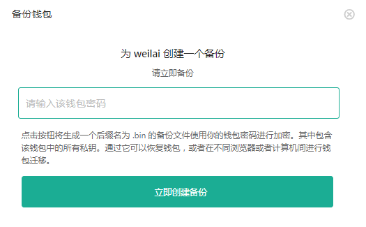
	* 点击下载备份
	* 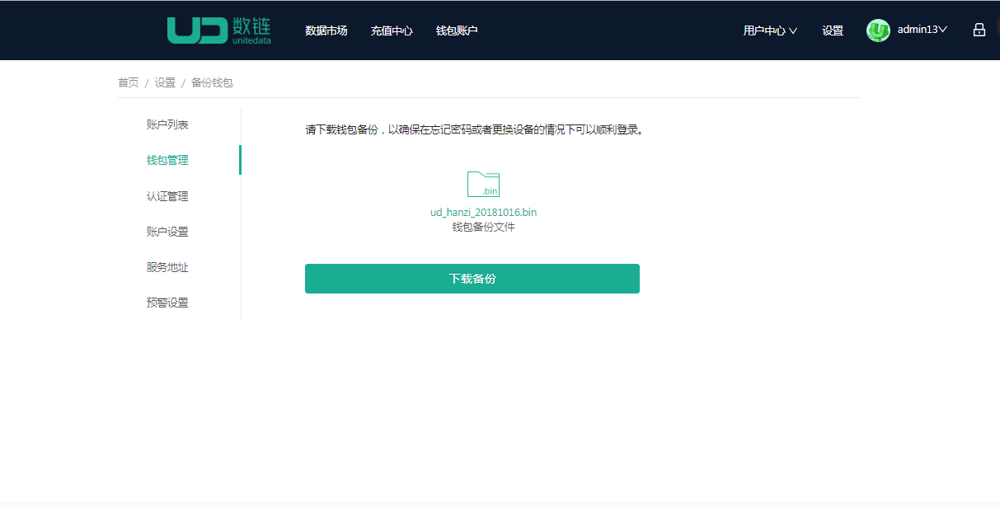
	* 保存备份文件，下次即可用备份文件恢复钱包或者登录，切记钱包的密码
	
4. 【导入钱包】

	基本流程：点击【导入钱包】-> 导入钱包文件 , 新钱包命名 -> 导入成功

	* 钱包管理页面，点击【导入钱包】
    * 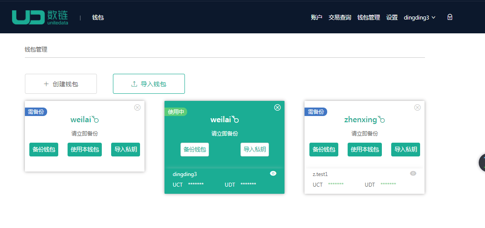
    * 导入钱包备份文件，输入钱包密码。点击【下一步】
    * 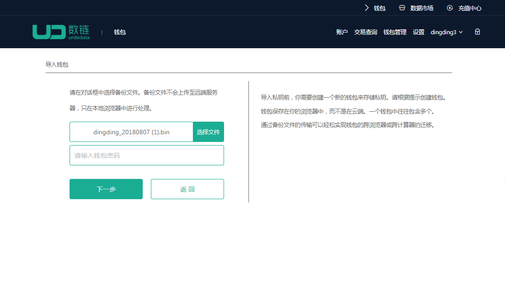
    * 导入成功，返回钱包管理页面
   
5. 【修改钱包密码】
    
     基本流程：点击【修改钱包密码】-> 输入密码信息 -> 修改成功

    * 选择需要修改密码的钱包，点击图标（密码修改图标）
    * 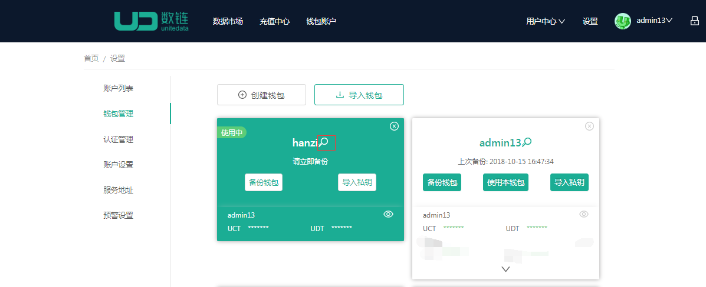
    * 输入钱包旧密码，新密码，和确认密码，点击【提交】
    * 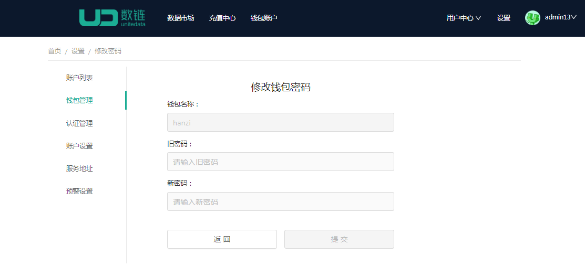
    * 修改成功

## 【设置】
##### 钱包账户列表
##### 钱包账户列表包含【查看私钥】和【忽略】账号功能
1. 【查看私钥】
    * 点击查看私钥，输入钱包密码。点击【确认】，即可查看私钥
    * 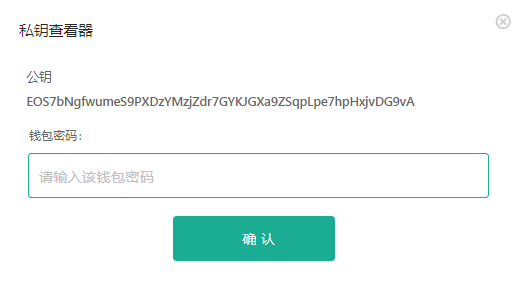
2. 【忽略】
    * 点击忽略，即该账号未登录状态。
    * 取消忽略后，账后又为登录状态。

##  解锁
1. 基本流程：点击解锁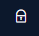  -> 输入钱包密码 -> 成功
	
2. 解锁后，10分钟内。转账，解锁，提额等操作不需要输入钱包密码。刷新页面后恢复正常。