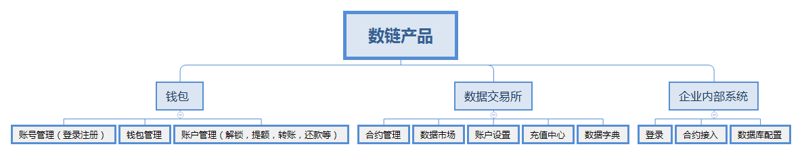

# 简介
数链，一个可信数据联盟。基于区块链技术，发展可信、开放、互利、公允的大数据区块链生态系统。

数链采用区块链的分布式账本与共识机制，制定分布式数据价值流通协议， 支持多方加密计算的数据价值共享和交换的智能合约，通过先进加密技术保护各 方私有数据，形成安全的、可交易的数据资产，采用安全多方计算实现可信任的 数据价值流通，使数据主体方、数据请求方、数据控制方、计算／存储／区块链 服务方能够在公平合规的技术环境中进行数据价值的共享、数据价值的交换、数 据价值的传输，实现数据驱动的商业进化，并创造新的经济价值增量。

 

# 产品介绍
##### 产品主要包含了钱包，数据交易所，数据桥接网关，充值中心，数据字典等系统。产品结构如下

1. 钱包
	* 账号管理: 数链统一的账号体系，管理数链所有产品的登录，注册。
	* 钱包管理：本地化管理账号的公钥和私钥。包含钱包的导入和创建，以及私钥的导入等功能。
	* 账户管理：管理数链的双token（即数积分，链积分）的互相转化，如解锁，提额，还款，转账等。
2. 交易市场
	* 数据交易市场：展示所有的数据合约。用户可以自由选择需要参与的合约。
	* 合约中心：用于管理创建或者参与的数据合约。设置合约的规则及模型。需求方和提供方都可以通过合约发布自己的需求
	* 账户设置：账户设置主要用于设置数据的服务地址，收款方式，联系方式等。
	* 充值中心：充值中心包含数积分和链积分的充值，数积分和链积分之间的兑换
	* 数据字典：规范数据合约的数据的标准化，方便需求方和提供方的规范化对接。主要包含了标准化的数据字典，和我的数据字典两大块功能。在标准化的数据字典基础上。若有特殊需求。也可进行创建或修改字典。
